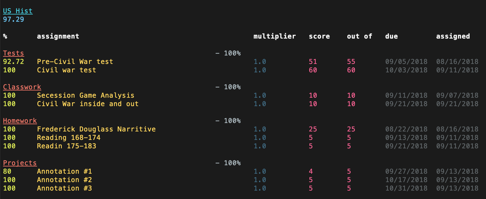

# infinite campus terminal

view grades from infinite campus through terminal.



modify config.py, then run:

```
python check_grades.py.
```

based on https://github.com/aaronduino/better-ic-grade-viewer

note: may not work outside of PAUSD. 